# 🎬영화 추천 커뮤니티 제작 project

# ⭐ Movie Of Galaxy

## 1. 팀원

| 이름  | 역할 및 업무                                                                        | Github                          |
| --- | ------------------------------------------------------------------------------ | ------------------------------- |
| 곽은정 | - Front-end \| Vue 클라이언트 구현 - Back-end \| Django 서버 구현(movies, accounts)    | https://github.com/eunjng5474   |
| 김동현 | - Front-end \| Vue 클라이언트 구현 - Back-end \| Django 서버 구현(community, accounts) | https://github.com/dongdongx2x2 |

## 

## 2. 프로젝트 기간 및 주제

- 2023.05.17(수) ~ 2023.05.26(금)
- 영화 추천 알고리즘 기반 커뮤니티 서비스

### 프로젝트 목표

- 영화 데이터 기반 추천 서비스 구성
- 영화 추천 알고리즘 구성
- 커뮤니티 서비스 구성
- 서비스 관리 및 유지보수

## 

## 3. 개발 배경 및 환경

### 개발 Tool

- Server : Django REST Framework - SQLite
- Client : Vue 2

### 협업 Tool

- Gitlab을 통한 소스코드 버전 관리 - branch를 통한 분업
- Notion을 통한 일정 및 자료 관리

## 

## 4. 데이터베이스 모델링 및 목업

### ERD

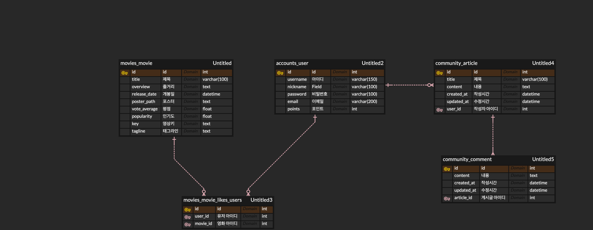

### 목업

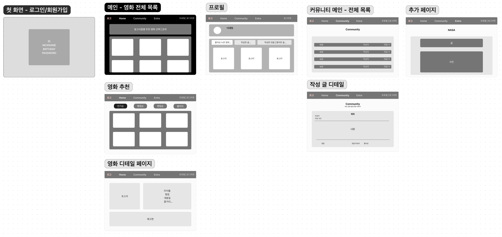

## 

## 5. 개발 일지

| 날짜       | 내용                                                                                                                                                                                                                                             | 이슈                                                                    |
| -------- | ---------------------------------------------------------------------------------------------------------------------------------------------------------------------------------------------------------------------------------------------- | --------------------------------------------------------------------- |
| 23.05.16 | 전반적 기획 - 목업을 통한 전체 레이아웃 구성 및 테마 구상 - 필수 요구사항 및 추가 기능 정의 및 우선순위 계획 - 영화 추천 알고리즘 - 인증 서비스 구현 방식 결정                                                                                                                                   |                                                                       |
| 23.05.17 | 기획 상세화 - ERD 작성을 통한 accounts, movies, community 모델링 - 목업 수정 및 구체화 데이터 수집 - TMDB를 통한 약 1000개의 SF 장르영화 추출 - 인기도, 평점, 줄거리 등 상세 정보와 예고편 key 포함 Back-end 기능 구현 - movies, community, accounts의 serializer, views, urls 기본 기능 구현 | 데이터 수집 과정에서 Xutf8을 통해 dumpdata시 한글 오류 해결                              |
| 23.05.18 | Front-end 기능 추가 구현 - django allauth를 통한 회원가입 및 로그인 기능 구현 - 전체 영화 목록 구성 및 상세 페이지 구현 - Community에서 게시글 목록 및 상세 페이지 구현                                                                                                                   | res.config.data의 타입에 따른 사용 이슈 - string의 데이터를 parse를 통해 object로 변경  |
| 23.05.19 | Front-end 기능 추가 구현 - 로그인/회원가입 모델, 폼 - 메인 화면 구성 Back-end 기능 구현 - 회원가입시 생년월일, nickname 추가 - 우저 정보를 DB에 저장되게 accounts의 serializer 및 view 수정                                                                                        | allauth 커스텀을 통해 회원가입 시 필드 추가 - adapters를 통해 모델 추가 및 DB에 저장         |
| 23.05.20 | Front-end 기능 추가 구현 - 게시글 상세 페이지에서 바로 댓글 CRUD 가능하도록 구성 - NavBar 컴포넌트 생성 후 페이지별 추가 - 영화 목록 및 상세 페이지 레이아웃 Back-end 기능 추가 구현 - 댓글 CRUD - 영화 좋아요 기능 구현                                                                            | getters 사용을 통해 비동기 이슈 해결                                              |
| 23.05.21 | Front-end 기능 추가 구현 - movie detail 1차 레이아웃 및 carousel 추가 Back-end 기능 추가 구현 - profile 페이지에 좋아요 한 영화 나오게 models 재설정(역참조)  - article 작성한 user 정보 보이게 model 수정                                                                          | 일부 axios 요청 시 headers에 토큰 필요 params 역시 요청마다 필요한 내용 확인              |
| 23.05.22 | Front-end 기능 추가 구현 - 영화 검색 기능 - profile에 유저의 별자리 정보 추가 Back-end 기능 추가 구현 - 로그아웃                                                                                                                                                    | created를 통해 routerlink를 통한 요청을 한 번만 실행하여 현재 페이지 재요청되는 이슈 해결           |
| 23.05.23 | Front-end 기능 추가 구현 - 좋아요 클릭시 토글 기능 추가 - 댓글/ 글 많아질 시 배경 넘어가는 것 수정 - movie detail, profile css 수정 - particle.js 를 활용한 우주 배경 만들기                                                                                                      | 유저가 로그인 할 때마다 현재 유저 정보를 저장하여 좋아요한 영화 목록 변경                            |
| 23.05.24 | Front-end 기능 추가 구현 - profile 별자리 사진 추가 및 전체적인 구성 - NASA API를 통한 날짜별 우주 정보 제공 - 게시글 및 댓글 작성/수정 form                                                                                                                                    | img src 바인딩 시 위 require(주소)로 작성 파파고 api의 CORS 이슈 발생으로 구글 번역 api 사용 |
| 23.05.25 | Front-end 기능 추가 구현 - 전체 페이지 CSS 디테일한 수정 - 발표 준비                                                                                                                                                                                          |                                                                       |

## 

## 6. 프로젝트 기획 의도 및 주요 기능

### 기획 의도

- SF 영화 흥행에 따른 SF 영화 마니아들을 위한 영화 추천 커뮤니티 제작
  - 특정 장르만을 대상으로 하여 마니아들의 만족도 증대
- SF 영화라는 특성에 맞는 우주 컨셉의 웹 사이트 구성

### 주요 기능

- 영화
  - 인기순, 평점순, 랜덤순 및 유저와 동일한 별자리의 영화 추천 알고리즘
  - 예고편을 포함한 영화 상세 정보 제공 및 좋아요 기능
- 커뮤니티
  - 게시글 및 댓글 CRUD
- 프로필
  - 유저 정보 및 좋아요한 영화 목록 제공
- 추가 페이지
  - Hero zone : 영화 캐릭터 및 관련 영화 검색 결과 제공
  - Daily space : NASA API 및 Google 번역 API를 통한 날짜별 우주 정보 제공

## 

## 7. 상세 페이지

### 7-1. 시작화면

- 첫 화면
  - 처음 들어올 시 사이트 로고와  particle.js 를 활용한 우주 배경을 통해 사이트 안내
  - Enter 버튼 클릭 시 login 화면으로 이동

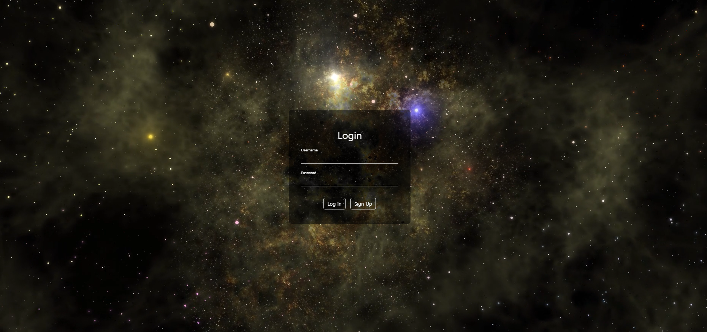

- 로그인 화면
  - 로그인을 해야만 이용할 수 있는 서비스로, sign up 버튼 클릭 시 회원가입 창 연결
  - 정확한 정보를 입력하지 않으면 alert를 통해 정확한 정보를 입력하도록 안내

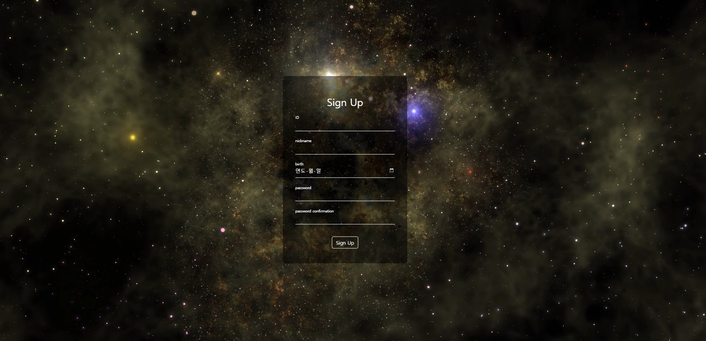

- 회원 가입 화면
  - id, nickname, birth, password 각각 알맞은 형태의 정보를 입력하지 않거나 비밀번호 확인 오류 시 alert를 통해 각 상황에 맞는 오류 안내

### 7-2. 메인 페이지

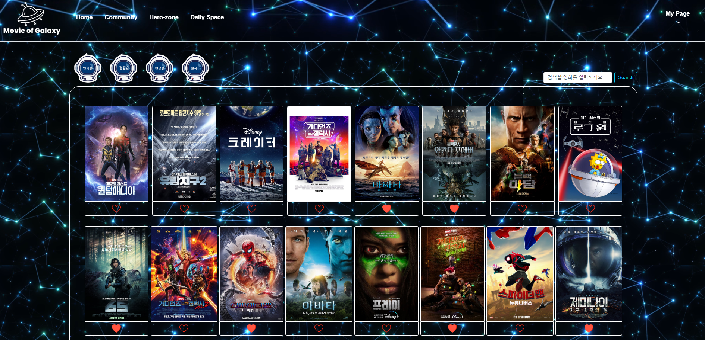

- 100개의 SF 영화 목록
  - 각 포스터를 누르면 디테일 페이지로 이동 및 하트 아이콘을 통한 좋아요 기능 구현
  - 왼쪽 상단 우주인 아이콘 클릭 시 각 알고리즘별 추천 페이지로 이동

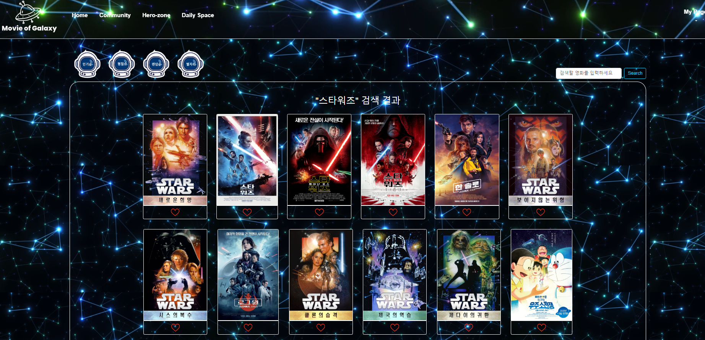

- 검색 페이지
  - 검색창에 단어를 검색하면 단어가 포함된 영화 목록 제공

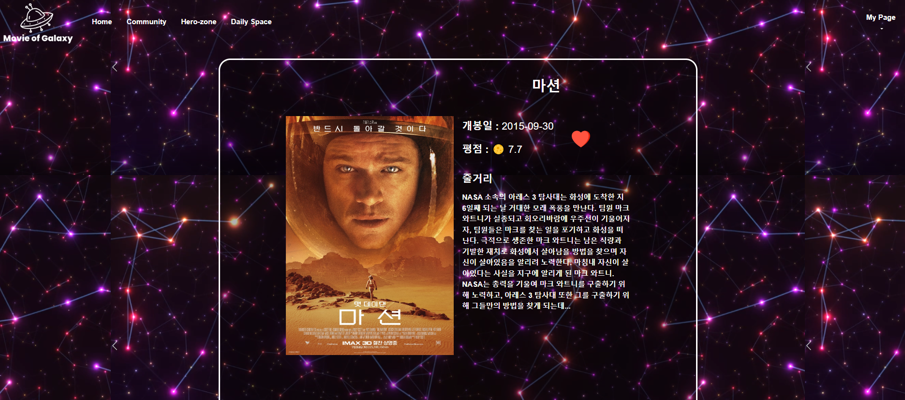

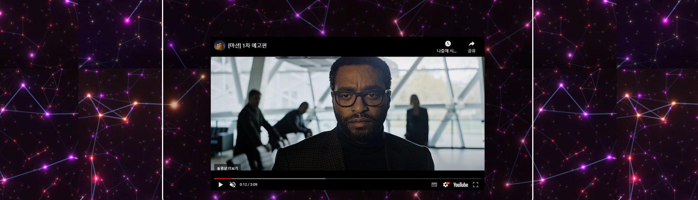

- 영화 디테일 페이지
  - 영화 포스터를 누르면 영화 디테일 페이지로 이동
  - 영화에 대한 정보, 좋아요, 자동재생의 영화 예고편 제공
    - 평점의 경우 보름달, 반달, 초승달을 통한 직관적인 구분 가능

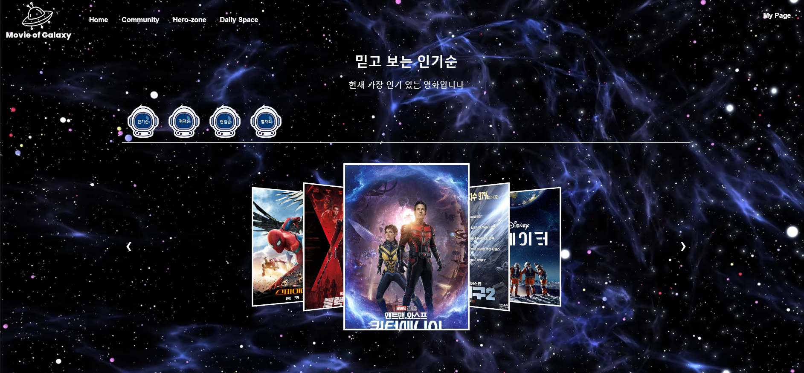

- 인기순 추천 페이지
  - carousel 형태의 인기순 상위 30개의 영화 제공
  - 영화 포스터 클릭시 해당 영화 디테일 페이지로 이동

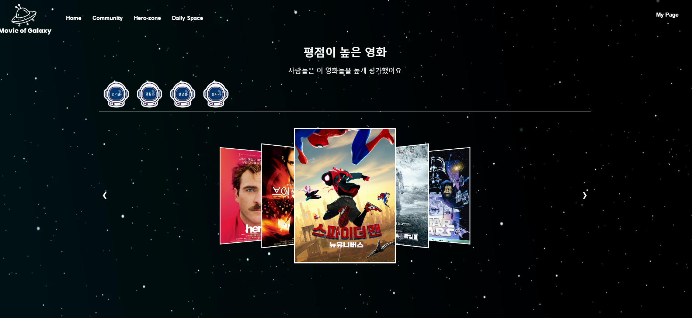

- 평점순 추천 페이지
  - carousel 형태의 평점순 상위 30개의 영화 제공
  - 영화 포스터 클릭시 해당 영화 디테일 페이지로 이동

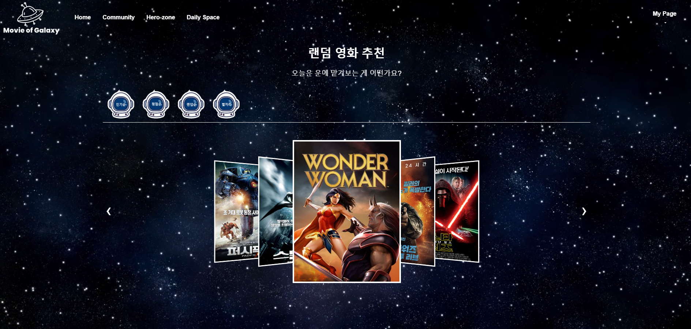

- 랜덤순 추천 페이지
  - carousel 형태의 랜덤 30개의 영화 제공
  - 영화 포스터 클릭시 해당 영화 디테일 페이지로 이동

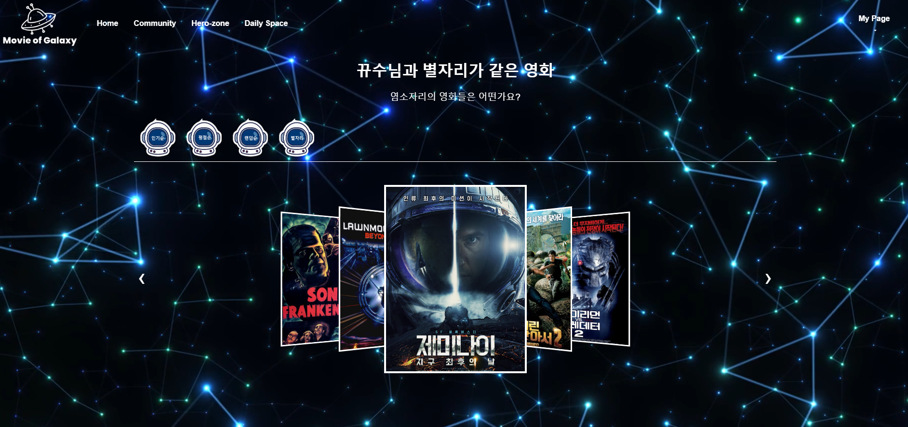

- 같은 별자리 추천 페이지
  - 영화의 개봉일을 기준으로 유저와 별자리가 같은 30개의 영화를 carousel 형태로 제공
  - 영화 포스터 클릭시 해당 영화 디테일 페이지로 이동

### 7-3. 프로필 페이지

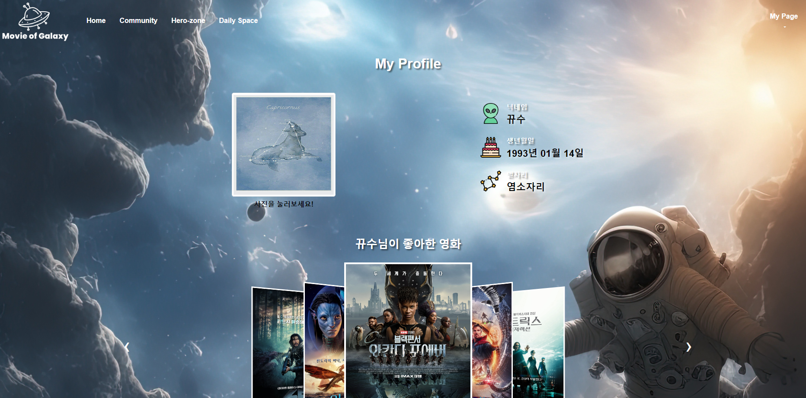

- user의 nickname, 생년월일, 별자리
- 별자리 사진 클릭 시 유저의 별자리 사진을 랜덤으로 바뀌도록 구현
- carousel 형태의 user가 좋아요 한 영화 목록 제공

### 7-4. 커뮤니티 페이지

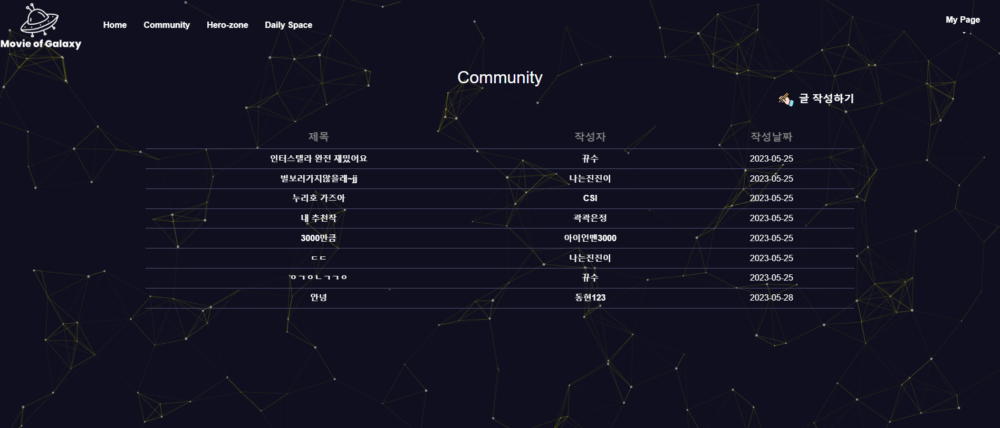

- community 전체글 페이지
  - 제목, 작성자, 작성날짜 표시
  - 작성자의 nickname 클릭시 해당 user의 프로필로 이동 가능

- community 상세글 페이지
  - 글 제목, 작성자, 내용, 그에 달린 comment들로 화면 구성
  - 해당 글 또는 댓글을 작성한 user일 경우 수정 삭제 가능

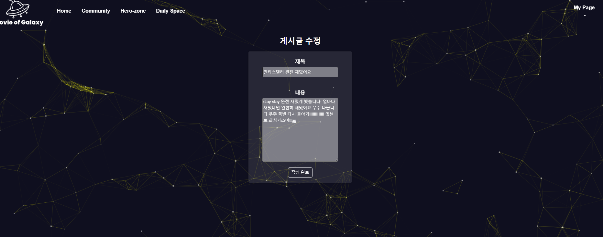

- 게시글 수정 페이지
  - 게시글 수정 클릭 시 제목과 내용이 포함된 상태에서 수정 가능

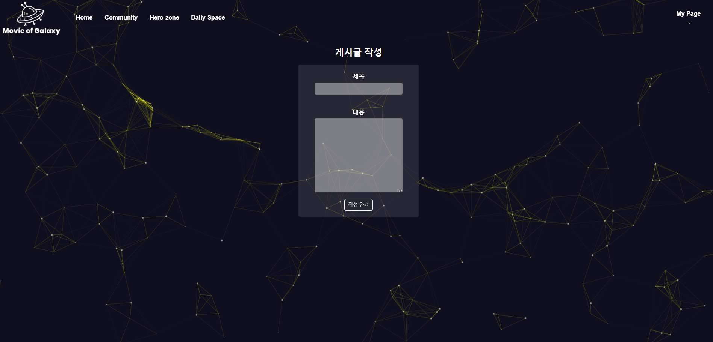

- 게시글 작성 페이지
  - 게시글 수정 페이지와는 달리 빈 칸의 form을 통해 내용 작성

### 7-5. Hero-zone

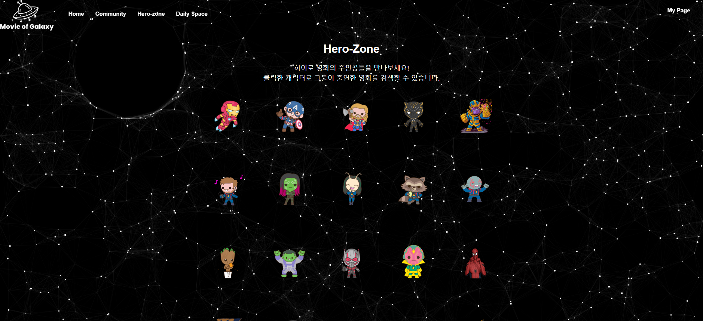

- SF 영화에 등장하는 주요 hero들의 캐릭터 제공
- 각 hero 클릭시 해당 hero가 나오는 영화 검색 결과 제공

### 7-6. Daily Space

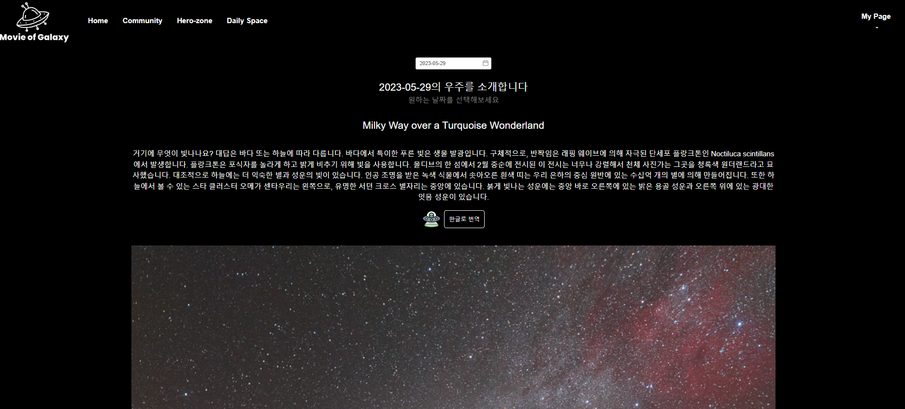

- SF가 컨셉인 만큼 NASA api를 이용하여 선택한 날짜에 해당하는 우주 사진 및 설명 제공
- 페이지 접속 시 기본으로 당일 날짜에 대한 정보 제공
- 구글 번역 api를 통해 영어로 된 내용을 한글로 번역하는 기능 추가